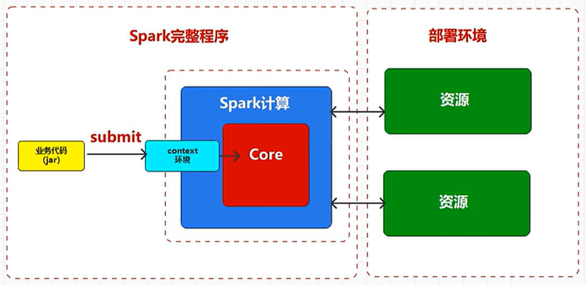

spark3


版本：spark-3.3.1

hdfs

map-reduce


高可用

1. 去中心化：所有节点都可以成为中心节点

2. 


https://hive.apache.org/docs/latest/adminmanual-installation_27362077/


Windows10系统下Hadoop和Hive环境搭建

https://www.cnblogs.com/xfeiyun/p/16740262.html


install hive

https://archive.apache.org/dist/hive/


winutils

https://github.com/Zer0r3/winutils


# 常用命令


https://developer.aliyun.com/article/1094681


```cmd
>path
PATH=D:\Program Files\VMWare16\bin\;C:\Python312\Scripts\;C:\Python312\;C:\WINDOWS\system32;C:\WINDOWS;C:\WINDOWS\System32\Wbem;C:\WINDOWS\System32\WindowsPowerShell\v1.0\;C:\WINDOWS\System32\OpenSSH\;D:\Develop\nodejs\;C:\ProgramData\chocolatey\bin;C:\Program Files\Microsoft SQL Server\150\Tools\Binn\;C:\Program Files (x86)\Windows Kits\10\Windows Performance Toolkit\;C:\Program Files\Microsoft SQL Server\Client SDK\ODBC\170\Tools\Binn\;C:\Program Files\dotnet\;D:\Program Files\Xftp7\;D:\Program Files\Xshell7\;D:\Program Files\Bandizip\;D:\Develop\Tools\Redis\;D:\Program Files\Git\cmd;D:\Develop\Tools\scala2.11.12\bin;D:\Develop\IDE\WeChatDevTools\dll;D:\Develop\Go\bin;C:\Program Files\Docker\Docker\resources\bin;C:\Program Files\MySQL\MySQL Shell 8.0\bin\;C:\Users\lenovo\AppData\Local\Microsoft\WindowsApps;D:\Program Files\MicrosoftVSCode\bin;C:\Users\lenovo\AppData\Roaming\npm;D:\Develop\Java\apache-maven-3.9.6\bin;C:\Users\lenovo\AppData\Local\Programs\oh-my-posh\bin;D:\Develop\nodejs\node_packages\npm;C:\Users\lenovo\.dotnet\tools;C:\Users\lenovo\AppData\Local\GitHubDesktop\bin;D:\Develop\ErlangOTP\bin;D:\Develop\Java\JDK\oraclejdk17.0.7\bin;D:\Develop\Tools\gradle\gradle-8.4\bin;C:\Users\lenovo\go\bin;C:\Users\lenovo\AppData\Local\Pandoc\;
```

如果是powershell

```powershell
# 换行输出
$env:path -split";"  


# 添加或修改(替换)环境变量
$env:myEnvTest="a Environment Variable Test"

# 向已有环境变量添加新项
$env:path+=";c:\your_path"

# 清空环境变量值
$env:myEnvTest=""

# 查看所有环境变量
ls env:

# 查看某环境变量
ls env:NODE_ENV
# 或查看path
ls env:path
```


# 部署Spark





